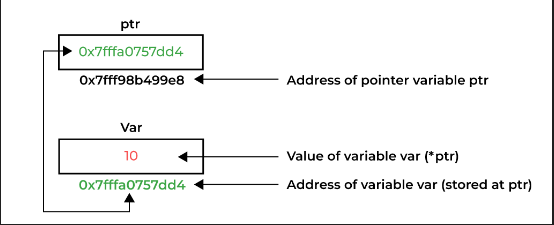
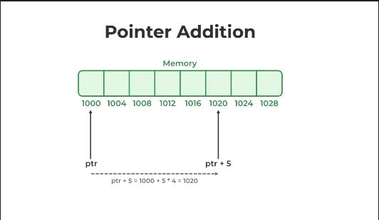
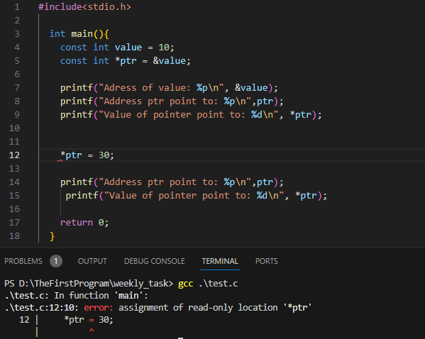
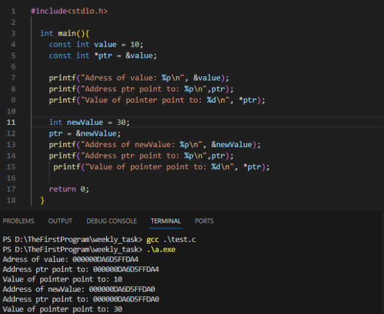
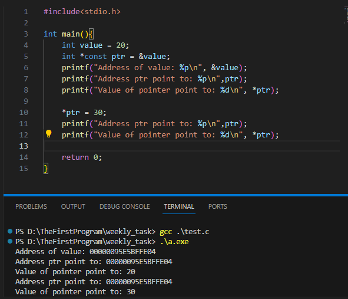
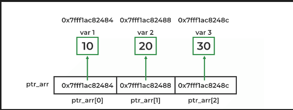
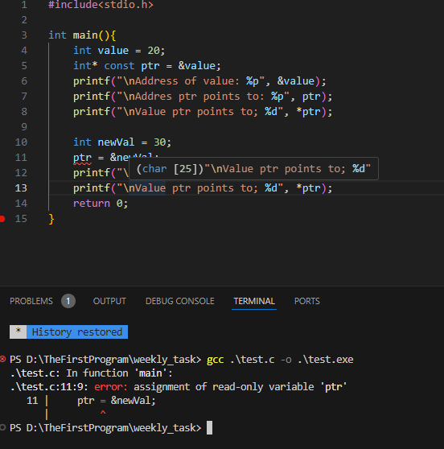

[](https://classroom.github.com/a/ELL84ZIj)
<!--
File: readme.md
Author: [Your Name]
Created on: [Date]
Description: [Brief description of the file's purpose]
-->

## Important: Please Add Your Own Report

Welcome to your report file. In the next section, please add your own report below. You can include your analysis, findings, and any relevant information.

Make sure to add your information to the begining of this file.

### Weekly Task Description

You can find the detailed description of the weekly task in the file: [task_description.md](task_description.md).

### Revision Task

For the revision task, please refer to: [revision.md](revision.md).

---

# Week 4 Report
**WEEK 4\:POINTER**
- [Week 4 Report](#week-4-report)
- [I. Overview about pointer](#i-overview-about-pointer)
- [II. Operation with pointer](#ii-operation-with-pointer)
  - [1. Assignment](#1-assignment)
  - [2. Comparison](#2-comparison)
  - [3. Arithmetic opertions](#3-arithmetic-opertions)
- [III. Pointer with array, string, dynamic memory allocation.](#iii-pointer-with-array-string-dynamic-memory-allocation)
  - [1. Const pointer \& Pointer to const](#1-const-pointer--pointer-to-const)
  - [2. Array and pointer](#2-array-and-pointer)
    - [a. Array pointer](#a-array-pointer)
    - [b. Pointer to an array](#b-pointer-to-an-array)
    - [c. Array of pointers](#c-array-of-pointers)
    - [d. Two-dimensional arrays](#d-two-dimensional-arrays)
  - [3. String](#3-string)
    - [a. What is a string?](#a-what-is-a-string)
    - [b. Common error when using string](#b-common-error-when-using-string)
  - [4. Dynamic memory allocation.](#4-dynamic-memory-allocation)
    - [a. Definion and Overview.](#a-definion-and-overview)
    - [b. NOTE:](#b-note)
    - [c. Function in DMA.](#c-function-in-dma)
    - [d. Dynamic memory allocation of 1D array.](#d-dynamic-memory-allocation-of-1d-array)
    - [e. Dynamic memory allocation of 2D array](#e-dynamic-memory-allocation-of-2d-array)
- [IV. Function pointer](#iv-function-pointer)
- [V. Multi-level pointer](#v-multi-level-pointer)
  - [1. Definition](#1-definition)
  - [2. Application](#2-application)

# I. Overview about pointer
- **Definition\:**
Pointer is a derived data type storing addresses of other variables like primitive data types, functions and even pointers. Programmers can access and manipulate the data stored in these addresses using pointers.
- **Declaration\:** We usually make declaration instead of initialization of pointers. To declare a pointer, we use `*`  dereference operator before its name.
  - **Syntax of pointer in C\:**
    `datatype *pointerName;`
    Example\:
    ` int *ptr; //a integer pointer called ptr`
    `char *ptr; //a pointer called ptr having char data type`
- **Data type\:**
  The data type of a pointer depends on the types of data it points to.
  Example\:
  ```c
  int *ptr;// Pointer to integers
  char *ptr; //Pointer to characters
  float *ptr;//Pointer to Floating-point numbers
  struct *ptr;// Pointer to stuctures
  int **ptr;// Pointer to pointers
  void *ptr;// Void pointer
  int (*ptr)(int, int);// Function pointer
  ```
- **Pointer Initialization\:** is the process where we assign some initial value to the pointer variable. We generally use the `&` address-of operatir to get the memory address of a variable and then store it in the pointer variable.
  - Example\:
    ```c
    int var =10;
    int *ptr;
    ptr = &var;
    ```
  - We can also declare and initialize the pointer in a single step, following the method called pointer definition.
    - Example\:
    ```c
    int *ptr = &var;
    ```
- **Pointer dereferencing**
  Dereferencing a pointer is the process of accessing the value stored in the memory address specified in the pointer. We use the same `*` dereferencing operator that we used in the pointer declaration.
    ```c
    int a = 10;
    int *p = &a;
    printf("Value of a: %d\n",a);           // a = 10
    printf("Value p point to: %d\n", *p);   // *p  = 10
    printf("Value of p: %p\n", p);          // p = &a
    printf("Address of a: %p\n", &a);       // Address of a
    printf("Address of p: %p", &p);         // Address of p
    ```

    

  * **Note\:** `*&p` =  `*(&p)` = `p` and `*&*p` = `*p`
    * **Always** initialize pointer `*p = NULL` when you haven't assigned any value to it yet.
    * **Always** check if pointer `*p` is `NULL` or not before using it.

# II. Operation with pointer
## 1. Assignment
   - Pointers can be assigned values (memory addresses) using the assignment operator `=` or the address-of operator `&`.
        ```c
        int a = 10;
        int *p1 = &a; // Assigns the address of num1 to p1
        int *p2 = *p1;// Assigns the value of p1(address of a) to p2
        ```
## 2. Comparison
   -  Pointers can be compared using relational operators\: `==`, `!=`, `<`, `>`, `<=`, `>=`.
   -  Pointer can compare with `0` or `NULL`to check if it points to a valid memory location or not.
        ```c
        //Pointer compare with '0' 
        int *ptr = 0;
        if(ptr == 0){
            printf("Pointer is 0\n");
        }
        else{
            printf("Pointer is not 0");
        }
        ```

   -  When you want to compare pointers, you have to ensure that comparison is compatible, which means that pointer should be compared to pointer or a specified address not a value
        ```c
        //Pointer compare with pointer
        int num1 = 10;
        int num2 = 20;
        int *p1 = &num1;
        int *p2 = & num2;
        if(p1 < p2){
            printf("num1 is smaller than num2");
        }

        //Pointer compare with a specified address
        int a = 10, b = 15;
        int *ptr = &a;
        if()
        ```
## 3. Arithmetic opertions
- Pointers can be manipulated using arithmetic operations such as addition, subtraction, and increment/decrement. This is particularly useful when dealing with arrays.
- The nature of increment/decrement of pointer is to move the pointer to the next or the previous address
    ```c
    int arr[5] = {1, 2, 5, 7, 6};
    int *p = arr; //Pointer p points to the 1st element of arr
    p ++;  // Moves p to the next element
    int nextElement = *p + 2;
    int thirdElement = *(p+2);// retrieves the value of the third element 
                              //of arr using pointer arithmetic
    printf("%d", nextElement); // nextElement = 4
    printf("\n%d", thirdElement); // thirdElement = 7
    ```
- The nature of adding an data type n to a pointer is to move the pointer to an address which is far from the initial address a distance of `sizeof(datatype) * n` bytes. This principle is also true for subtraction.
- For example, `*ptr` is an integer pointer that stores 1000 as an address. If we add integer 5 to it using the expression, `ptr = ptr + 5`, then, the final address stored in the ptr will be `ptr = 1000 + sizeof(int) * 5 = 1020`.

    
-  **Subtraction of 2 pointers\:** The subtraction of two pointers is possible only when they have the same data type. The result is generated by calculating the difference between the addresses of the two pointers and calculating how many bits of data it is according to the pointer data type. For example\:
    ```c
    #include<stdio.h>
        
    int main(){
        int x = 6, N = 4;
        int *ptr1 = &N;// Initialize ptr1 storing address of N
        int *ptr2 = &x;// Initialize ptr2 stoging address of x
        x = ptr1 - ptr2;
        printf("%d", x); // Subtraction of ptr1 and ptr2 is 1
        return 0;
    }
    ```
- The above example shows that subtraction between 2 pointers **gives the increments** between the 2 pointers.
- **Operations with void pointer\:** Generally, there does not exit operations of void pointer because we do not know about the data type of variable that void pointer point to. However, we can still carry out operations with void pointers by type coercion. For example\:
    ```c
    #include<stdio.h>

    int main(){
        int arr[5] = {1, 2, 3, 4, 5};
        void *ptr = arr // void pointer point to arr[0]

        int *intPtr = (int*)ptr// convert ptr into intPtr having integer data type

        intPtr ++;// Move the intPtr to the next element

        printf("%d", *intPtr); //print out value of the next element
        return 0;
    }
    ```
- **Operations with function pointer\:** We can not directly aplpy arithmetic operations to function pointer, but we can still effectively work with them by using other means, such as loops and indexing. For example\:
    ```c
    #include<stdio.h>

    void func1(){
        printf("Hello World!");
    }

    void func2(){
        printf("Hello Quang Huy Tran");
    }
    int main(){
        void (*ptr[2])() = {func1, func2};
        for(int i = 0; i < 2; i++){
            ptr[i]();
        }
        return 0;
    }
        
    ```
# III. Pointer with array, string, dynamic memory allocation.
## 1. Const pointer & Pointer to const
- **Pointer to constant\:** In the pointers to constant, the data pointed by the pointer **initially** is **constant** and cannot be changed, even if the pointer itself can change and points somewhere else.
- For example\: 
  
  

- You can change the value that the pointer point to only by initialzing it another variable\:

  

  - **Usage\:** 
    - Ensure a pointer itself remains constant throughout its lifetime.
    - Create a global pointers or define constants.
- **Constant pointer\:** In constant pointers, the pointer points to a fixed memory location and the value at that location can be changed, but the pointer will **always** point to the same location.

- For example\:
  
  

- Only can change the value at the location that the pointer points to\:

  

  - **Usage\:**
    - Ensure the data pointed to by the pointer remains constant through its lifetime.
    - Useful for passing parameters to functions when you want to prevent the function from modifying the original data.
- **Constant pointers to constants\:** In the constant pointers to constants, neither the data pointed to by the pointer nor the pointer itself can be changed.
- For example\:
  
  ```c
  const int value = 10;
  const int *const ptr = &value;
  
  printf("Address of value: %p\n", &value);
  printf("Address ptr point to: %p\n",ptr);
  printf("Value of pointer point to: %d\n", *ptr);

  *ptr = 30; //invalid
  int newValue = 20;
  ptr = &newValue;//Invalid
  ```
  - **Usage\:**
    - Defining constant values in program
    - Passing parameters to functions without allowing the function to modify the original data
    - Creating global constants
## 2. Array and pointer
### a. Array pointer
- When we declare an array, it means that we set a continuous block of memory in stack or heap, depending on where the array is declared
- Pointes and arrays are so closely related that an array name acts as a pointer constant which has value which is the address of the 1st element of array.
- For example\:
  ```c
  #include<stdio.h>

  int main(){
    int arr[5] = {1, 2, 3, 4, 5};
    printf("%p\n", arr);//address of arr[0]
    printf("%d\n", *arr);//the value that pointer arr points to
    return 0;
  }
  ```
- Besides, we can also pointer arithmetic operations such as increment, decrement, addition, substraction of integers on pointer to move between array elements. 
- For example\:
     ```c
    int arr[5] = {1, 2, 3, 4, 5};
    printf("%p\n", arr);//address of arr[0]
    printf("%d", *arr);// value of arr[0]
    printf("%d %d %d\n", arr[1], arr[1], arr[2]); //elements of array using index
    printf("%d %d %d\n", *(arr + 1), *(arr + 2), *(arr + 3));//elements of array using pointer arr
    
    ```
- However, we can not **directly** use increment or decrement with an array name because array name is a constant address. We can only use those operations with an equivalent pointer pointing the 1st element of the array.
    ```c
    int arr[5] = {1, 2, 3, 4, 5};
    int *ptr = arr;
    printf("%d\n", *ptr);// arr[0]
    ptr ++;
    printf("%d\n", *ptr);//arr[1]
    ``` 
- **NOTE\:** 
  - For `arr[-2]` and `-2[a]`, these two commands are **undefined**. Both expressios are attempting to access memory locations outside the bounds of the array arr, which results in undefined behavior.
  - **Difference between `arr` , `&arr` and `&a[0]`\:**
      Consider the case, `arr` is an array of type `int`.  Therefore, `&arr` is a pointer-to-array of type `int` and `&arr[0]` is a pointer to the 1st element of array arr. Besides, although `arr` and `&a[0]` have the same address pf the 1st element of array but they have different types:
        - `arr` is of type "array of `int` "
        - `&a[0]` is of type "pointer to `int` "
### b. Pointer to an array
- Pointer to an array is pointer that point to the whole array. This pointer is useful when talking about multidimensional arrays. 
     ```c
    #include<stdio.h>
    
    int main(){
    int arr[5] = {1, 2, 3, 4, 5};
    int *p;// Pointer to an integer
    int (*ptr)[5];//Pointer to an array of 5 integers
    p = arr;// Point to element index 0 of the array
    ptr = &arr;//Point to the whole array
        printf("%p %p",p,ptr);//p = 00000003DADFFBC0, 
                              //ptr =00000003DADFFBC0;
      
    p++;
    ptr++;
    printf("\n%p %p",p,ptr);// p = 00000003DADFFBC4, 
                            //ptr= 00000003DADFFBD4

    return 0;
    }
    ``` 
- Application to multidimensional array
 
  ```c
  #include <stdio.h>

  int main() {
      int arr[3][2] = {{1, 2}, {3, 4}, {5, 6}}; // 2D array

      // Pointer to an array of integers
      int (*ptr)[2]; // Pointer to an array of 2 integers

      ptr = arr; // Assigning the address of the first array to ptr

      // Accessing elements using pointer to an array
      for(int i = 0; i < 3; i++){
        for(int j = 0; j < 2; j++){
          printf("\n%d", *(*(ptr + i) + j));
        }
      }
      return 0;
  }
  ```
### c. Array of pointers
- Similarly to an normal array, array of pointers is a collection of one-type variables. In this case variables are pointers which have the same type as the array. For example\:
  ```c
  int var1 = 10;
  int var2 = 20;
  int var2 = 30;
  
  int *ptr[3] = {&var1, &var2, &var3};// array of integer pointers
  ```
  

- **Passing an array to a function**
We can pass an array to a function  through reference or using equivalent pointers.
  - **Pass individual array elements\:** You can pass an individual array element to a function by using its index or pointer. For example\:

    ```c
    #include<stdio.h>
    // function using index 
    void display(int num);
    //function using pointer
    void printArray(int *ptr);

    int main(){
      int num[] = {1, 2, 3, 4, 5};
      int *ptr = num;

      display(num[2]);

      printArray(ptr + 3);
      return 0;
    }

    void display(int num){
      printf("%d\n", num);
    }

    void printArray(int *ptr){
      printf("%d ", *ptr );
    }
    ```
  - **Pass arrays to function\:** You can pass arrays to function by using array itself or pointer pointing to array. For example\:
    ```c
    #include<stdio.h>

    // using array index
    void printArray(int arr[]);
    // using array of pointers
    int sum(int *ptr[]);

    int main() {
        int arr[] = {1, 2, 3, 4, 5};
        int *ptr[5]; // Array of pointers to integers
        for(int i = 0; i < 5; i++) {
            ptr[i] = &arr[i];
        }

        printArray(arr); 

        printf("\n%d", sum(ptr)); 

        return 0;
    }

    void printArray(int arr[]) {
        for(int i = 0; i < 5; i++) {
            printf("%d \n", arr[i]);
        }
    }

    int sum(int *ptr[]) {
            int s = 0;
            for(int i = 0; i < 5; i++) {
                s += *ptr[i];
            }
            return s;
        }
    ```
### d. Two-dimensional arrays
A 2D array is the simplest form of the multidimensional array. Its nature is an array of another array. For example\:
` int arr[2][3]` is equivalent to an array arr[2] consisting of 3 elements.
## 3. String
### a. What is a string?
- **Definition\:** A string is a sequence of characters terminated with a null character `\0`. In C, string is stored as an array of characters.
- **Syntax\:** Declaring a string in C a simple a declaring a one-dimensional array.
  `char string_name[size];`
- **Note\:** 
  - A string can be assigned with either size or no size, but we should **always** account for one extra space which will be assigned to the `NULL` character.

    ```c
    char str[5] = "abcde"// wrong
    char str[5] = "abcde"// correct
    ```
  - After declaration, if we want to assign some other text to the string, we have to assign it one by one or use the built-in `strcpy()` function because the direct assignment of the string literal to character array is only possible in declaration.
    ```c
    #include<stdio.h>
    #include<string.h>
    
    int main(){
    char destination[20];
    char source[] = "Hello World!";

    destination = "Hello world!"//ERROR
    strcpy(destination, source);//CORRECT

    printf("Destination: %s", destination);

    return 0;
    }

    ```
### b. Common error when using string
- **Buffer overflow\:**
  ```c
  char *str[5];
  //using gets()
  gets(str);

  //using strcpy()
  strcpy(str, "Hello World!");
  ```
  In above code, user can suffers from **Buffer Overflow** as `gets()` and `strcpy()` does not do any bound testing. `gets()` keeps on reading until it sees a newline character.
  <br>
  **Therefore**, to avoid Buffer Overflow, `fgets()` should be used instead, because `fgets()` makes sure that not more than MAX_LIMIT character are read.
  
  ```c
  #include<stdio.h>
  #define MAX 15

  int main(){
    char buf[MAX];

    fgets(buf, MAX, stdin);
    printf("\n%s", buf);
    return 0;
  }
  ```
- **Segmentation fault\:**
  ```c
  char *str = "Hello World!";
  str[6]= 'A';
  ```

  The code above, `str` is initialized as a pointer to a literal string "Hello World!", which is stored in read-only memory, so although `str[6] = 'A'` tries to modify the character at index 6 of the string literal, it makes no senses and can lead to undefined behavior.
  <br>
  **Therefore**, to fix this code, we need to allocate memory for `str` as an array.

  ```c
  #include<stdio.h>
  #include<string.h>

  int main(){
    char str[] = "Hello World!";
    str[6] = 'A';

    printf("%s", str);
    return 0;
  }
  ```
- A similar error when we try to assign a sequence of characters to a pointer\:
  ```c
  int str[100];
  str = "Hello World!";
  ```
  In the above code, `str` is declared as an array so `str` acts as a pointer to the 1st element of the array, so `str = "Hello World!" ` is invalid because we are trying to assigned a sequence of character to a pointer.
<br>
  **Therefore**, to fix this code we can use `strcpy()` to initialize the string.

  ```c
  #include<stdio.h>
  #include<string.h>

  int main() {
      char str[100];
      strcpy(str, "Hello World!");
      printf("%s", str);
      return 0;
  }
  ```
- Another similar error\:
  ```c
  void main(){
    char str[100] = "absbf";
    if(str == "absbf"){
      printf("1");
    }
  }
  ```
  In the above code, when we try to compare a string with a pointer, it is incompatible. To fix this, we need to change to compare 2 strings or 2 pointers.

  ```c
  #include<stdio.h>
  #include<string.h>

  int main() {
      char str[100] = "Quangxeng";
      if (strcmp(str, "Quangxeng") == 0) { 
          printf("1");
      }
      return 0;
  }

  ```
## 4. Dynamic memory allocation.
### a. Definion and Overview.
- **Definition\:** Sometimes the size of the array we declared may be insufficient. To solve this issue, you can allocate memory manually during run-time. In summary, dynamic memory allocation is to allocate the memory for an array.
  
  |     | Dynamic memory allocation | Static memory allocation |
  | --- | ------------------------- | ------------------------ |
  | **Advantages**|- **Flexibility\:** DMA allows program to request memory at runtime, providing flexibility in managing memory usage <br><br>- **No Wastage\:** Memory is allocated only when needed, which can help avoid wasting memory. <br><br>- **Resizable Structures\:** Data structures can be resized dynamically, allowing for efficient memory usage.|- **Speed\:** Static memory allocation is faster than dynamic allocation because memory is allocated at compile time. <br><br> - **Predictability\:** Memory allocation is predictable and deterministic, making it easier to manage memory usage. <br> <br>- **No Fragmentation\:** Since memory is allocated at compile time and remains fixed during program execution, there is no fragmentation issue.|
  | **Disadvantages** |- **Memory leaks\:** If memory is not deallocated properly after use, it can lead to memory leaks, causing the program to consume more memory over time. <br> <br> - **Fragmentation\:** Over time, the memory may become fragmented, making it difficult to find contiguous blocks of memory for allocation.<br> <br> - **Overhead\:** Dynamic memory allocation involves overhead in terms of performance and complexity compared to static allocation.  |- **Fixed Size\:** The size of memory is fixed at compile time, making it less flexible for applications where memory requirements are not known in advance.<br><br> - **Wastage\:** There can be wastage of memory if allocated memory is not fully utilized.<br><br> - **Limited Scalability\:** Static allocation may not be suitable for applications that require dynamic resizing of data structures or memory.|
<br>

### b. NOTE\: 
  - In dynamic memory allocation, we **always** ensure that **ALL** allocated memories are **freed**.
  - **DO NOT** free one memory two times.
  - Free the memory in the **memory-allocated area**.
  - Check if the pointer is `NULL` before free.
  <br>

### c. Function in DMA.
- In dynamic memory allocation, we can use some built-in functions to allocate the memory block again\:
  - `malloc()`(memory allocation) reserves a block of memort of the specified number of bytes and returns a pointer of `void`\:
    `ptr = (cast_type*)malloc(size);`
    ```c
    #include<stdio.h>
    #include<stdlib.h>

    int main(){
        int n;
        scanf("%d", &n);
        int *arr;
        arr = (int*)malloc(n * sizeof(int));
        for(int i = 0; i < n; i++){
            printf("arr[%d] = ", i);
            scanf("%d", (arr + i));
        }

        for(int i = 0; i < n; i++){
            printf("\narr[%d] = %d", i, *(arr + i));
        }
        free(arr);
        return 0;
    }
    ```
  - `calloc()`(contiguous allocation) allocates memory and initializes all bits to zero, whereas `malloc()` leaves the memory uninitialized. This function also returns a pointer of `void`\:
    `ptr = (cast_type*)calloc(n, size);`
    ```c
    #include<stdio.h>
    #include<stdlib.h>

    int main(){
        int n;
        scanf("%d", &n);
        int *arr;
        arr = (int*)calloc(n * sizeof(int));
        for(int i = 0; i < n; i++){
            printf("arr[%d] = ", i);
            scanf("%d", (arr + i));
        }

        for(int i = 0; i < n; i++){
            printf("\narr[%d] = %d", i, *(arr + i));
        }
        free(arr);
        return 0;
    }
    ```
  - `realloc()`(reallocate the memory)try to expand the size of previously allocated memory to the backward. Otherwise, it will allocate a new memory for the pointer and also return a pointer of `void`\:
    `ptr = realloc(ptr, size);`

    ```c
    #include<stdio.h>
    #include<stdlib.h>

    int main(){
        int n;
        scanf("%d", &n);
        int *arr;
        arr = (int*)malloc(n * sizeof(int));
        for(int i = 0; i < n; i++){
            printf("arr[%d] = ", i);
            scanf("%d", (arr + i));
        }

        for(int i = 0; i < n; i++){
            printf("\narr[%d] = %d", i, *(arr + i));
        }
        int newnum;
        scanf("%d", &newnum);
        arr = (int*)realloc(arr, newnum * sizeof(int));
        printf("Address of newly allocated memory area: %X", arr);
        free(arr);
        return 0;
    }
    ```
  - `free()` used to explicitly release the allocated memory created with either `calloc()` or `malloc()`\:
    `free(ptr);`
### d. Dynamic memory allocation of 1D array.
- When we want to allocate memory for an one-dimensional array, we can use either `malloc()` and `calloc()`
- Syntax\:
  ```c
  datatype *arr;
  arr = (data_type*)malloc(size);
  arr = (data_type*)calloc(size);
  ```
- For example\:

  ```c
  #include<stdio.h>
  #include<stdlib.h>
  void scan_array(int *arr, int n);

  void print_array(int *arr, int n);

  void add_element(int *a, int n, int val, int pos);

  void delete_element(int *a, int n, int pos);

  int main(){
      int *arr;
      int n;
      scanf("%d", &n);
      arr = (int *)malloc(n * sizeof(int));
      if(arr == NULL){
          exit(0);
      }
      scan_array(arr, n);
      printf("Scaned Array:");
      print_array(arr, n);
      printf("\nAdd element:");
      int val, pos;
      printf("pos = "); scanf("%d", &pos);
      printf("val = "); scanf("%d", &val);
      add_element(arr, n, val, pos);
      printf("Added array is: ");
      print_array(arr, n);
      return 0;
  }

  void scan_array(int *arr, int n){
      for(int i = 0; i < n; i++){
          printf("\narr[%d] = ",i);
          scanf("%d", (arr + i));
      }
  }
  void print_array(int *arr, int n){
      for(int i = 0; i < n; i++){
          printf("\narr[%d] = %d", i, *(arr + i));
      }
  }
  void add_element(int *a, int n, int val, int pos){
      a = (int *)realloc(a, (n + 1) * sizeof(int));
      // choose the place to extent
      if(pos < 0){
          pos = 0;// at the begin of the array
      }
      else if(pos > n){
          pos = n;// at the end of the array
      }
      //move the array before add new value
      for (int i = n; i > pos; i--){
          *(a + i) = *(a + i - 1);
      }
      //add val at pos
      *(a + pos) = val;
      //Increase the number of elements after adding val
      ++n;
  }
  void delete_element(int *a, int n, int pos){
      if(n <= 0){
          return;
      }
      if(pos <= 0){
          pos = 0;
      }
      else if(pos >= n){
          pos = n - 1;
      }
      //Move the array after delete
      for(int i = pos; i < n; i++){
          *(a + i) = *(a + i +1);
      }
      //reallocate the memory
      a = (int *)realloc(a, (n-1) * sizeof(int));
      //decrease the number of elements after deleting.
      --n;
  }
  ```

### e. Dynamic memory allocation of 2D array
1. **Using 2nd-level pointer**
- When we want to allocate memory for a two-dimensional array by using double pointer, we have to allocate memories for  an array of pointers(rows), and then for each row individually.
  ```c
  a = (int **)malloc(row * sizeof(int));
  for(int i = 0; i < row; i++){
    a[i] = (int*)malloc(col * sizeof(int));
  }
  ```
  <br>

- Similarly, when we want to free the memory, we also have do it step by step, free each row then free the pointer.
  ```c
  for(int i = 0; i < row; i++){
    free(a[i]);
  }
  free(a);
  ```
- Code example\:
  ```c
  #include<stdio.h>
  #include<stdlib.h>

  void scan_matrix(int **arr, int row, int col);

  void print_matrix(int **arr, int row, int col);

  int main(){
      int **arr = NULL, row, col;
      scanf("%d%d", &row, &col);

      arr = (int **)calloc(row, sizeof(int));
      for(int i = 0; i < row; i++){
          arr[i] = (int *)calloc(col, sizeof(int));
      }

      scan_matrix(arr, row, col);
      print_matrix(arr, row, col);

      for(int i = 0; i < row; i++){
          free(arr[i]);
      }
      free(arr);
      return 0;
  }

  void scan_matrix(int **arr, int row, int col){
      for(int i = 0; i < row; i++){
          for(int j = 0; j < col; j++){
              printf("\na[%d][%d] = ", i, j);
              scanf("%d", &arr[i][j]);
          }
      }
  }

  void print_matrix(int **arr, int row, int col){
      for(int i = 0; i < row; i++){
          for(int j = 0; j < col; j++){
              printf("%d ", arr[i][j]);
          }
          printf("\n");
      }
  }
  ```
2. **Using 1D array to display 2D array**
- Notice that a 2D array with size of m rows x n cols is equivalent to an 1D array with size m x n; therefore, `a[i][j] ~ a[i * n + j]`.
- For example\:
  ```c
  #include<stdio.h>
  #include<stdlib.h>

  void scan_matrix(int *arr, int row, int col);

  void print_matrix(int *arr, int row, int col);

  int main(){
      int *arr = NULL, row, col;
      scanf("%d%d", &row, &col);

      arr = (int *)calloc(row * col, sizeof(int));
      
      scan_matrix(arr, row, col);
      print_matrix(arr, row, col);

      free(arr);
      return 0;
  }

  void scan_matrix(int *arr, int row, int col){
      for(int i = 0; i < row; i++){
          for(int j = 0; j < col; j++){
              printf("\narr[%d][%d] = ", i, j);
              scanf("%d", (arr + i * col + j));
          }
      }
  }

  void print_matrix(int *arr, int row, int col){
      for(int i = 0; i < row; i++){
          for(int j = 0; j < col; j++){
              printf("%d ", *(arr + i * col + j));
          }
          printf("\n");
      }
  }
  ```
# IV. Function pointer
1. **Function addresses**
  - **Definition\:** functions are also stored in memory and their addresses can be obtained like variable addresses.
  - **Usage\:** 
    - **Using the Adress-of Operator(`&`)\:**
   
      ```c
      #include<stdio.h>
      void myFunction(){
        printf("Hello World!");
      }
      int main(){
        printf("Address of myFunction: %p\n",(void*)&myFunction);
        return 0;
      }
      ```
2. **Function pointers\:** are variables that store addresses of functions and they are also declared similarly to regular pointers.
  
- Syntax\: ` data_type(*fun_ptr_name)(parameter_type);`
- For example\:
  ```c
  #include<stdio.h>

  int add(int a, int b){
    return a + b;
  }
  int main(){
    int (*ptr)(int, int) = add;
    int a, b;
    scanf("%d%d", &a, &b);
    printf("\n%d", ptr(a, b));
    return 0;
  }
  ```
3. **Constant function pointer**
- We use pointer to const as a parameter of the function to ensure that the value passed to the function keeps unchanged.
- For example\:
  ```c
  #include<stdio.h>
  //const function pointer
  void print_array(const int *arr, int length);

  int main(){
    int arr[] = {1, 2, 3, 4, 5};
    int length = sizeof(arr) / sizeof(int);

    print_array(arr, length);
    return 0;
  }

  void print_array(const int *arr, int length){
    for(int i = 0; i < length; i++){
      printf("\n%d ", *(arr + i));
    }
  }
  ```
4. **Usage of function pointer\:**
  - Function pointer is commonly used for callback functions.
    ```c
    #include <stdio.h>

    void my_callback(int num);

    void caller_function(void (*callback)(int), int value);

    int main() {
        // Declare a function pointer
        void (*ptr)(int) = my_callback;

        // Call caller_function and pass ptr as the callback
        caller_function(ptr, 10);

        return 0;
    }
    void my_callback(int num) {
        printf("Callback invoked with number: %d\n", num);
    }

    void caller_function(void (*callback)(int), int value) {
        // Invoke the callback function
        callback(value);
    }
    ```
5. **Using pointer as parameter passed to the function**
- When we want to implement pointer as a parameter of the function, we have to use reference for the pointer. For example\:

  ```c
  #include<stdio.h>
  void setToNull(int **ptr)	
  {
    *ptr = NULL;
  }

  int main()
  {
    int value = 5;
    int *pValue = &value;
    
    printf("\npValue point to: %x", (void*)pValue);

    setToNull(&pValue);
    if(pValue == NULL)
      printf("\nThis pointer is NULL");
    else
      printf("\npValue points to: %x", (void*)pValue);
    
    return 0;
  }
  ```
  In the above code, we see that the pointer `pValue` is assigned to `NULL` after passed to the function `setToNull`. This is because the parameter of the function is a double pointer (`**ptr`), it will reference the argument passed to it. In this case, the pointer reference parameter `ptr` shares the same addresses as `pValue`, so any changes made to the value held by `ptr` also affect the value of `pValue`.
6. **Array of function pointer**
- Like normal pointers, we can have an array of function pointers. For example\:
  ```c
  #include<stdio.h>

  void add(int a, int b);

  void subtract(int a, int b);

  void multiply(int a, int b);

  void divide(int a, int b);

  int main(){
    //array of function pointers
    void (*func_ptr_arr[])(int, int) = {add, subtract, multiply, divide};

    int choice;
    int a = 10, b = 2;

    printf("Enter choice: "); scanf("%d", &choice);
    if (choice > 3){
      return 0;
    }
    else{
      (*func_ptr_arr[choice])(a, b);
    }

    return 0;
  }

  void add(int a, int b){
    printf("\na + b = %d", a + b);
  }

  void subtract(int a, int b){
    printf("\n a - b = %d", a - b);
  }

  void multiply(int a, int b){
    printf("\na * b = %d", a * b);
  }

  void divide(int a, int b){
    printf("\na / b = %d", a / b);
  }
  ```

- **NOTE**\:
  - `int(*)[10]` is a pointer that can point to an array of 10 integers.
  - `int *a[10]` is an array of pointers to integers.
  - For example\:
    ```c
    #include<stdio.h>

    int main(){
      int arr[10] = {1, 2, 3, 4, 5, 6, 7, 8, 9, 10};
      int (*ptr_to_arr)[10];
      ptr_to_arr = &arr;
      for(int i = 0; i < 10; i++){
        printf("\narr[%d] = %d ", i, (*ptr_to_arr)[i]);
      }

      int *arr_of_ptr[10];
      for(int i = 0; i < 10; i++){
        arr_of_ptr[i] = &arr[i];
        printf("\narr[%d] = %d", i, *(arr_of_ptr[i]));
      }
      
      return 0;
    }
    ```
# V. Multi-level pointer
## 1. Definition
- A multi-level pointer is a pointer that points to another pointer, which in turn can point to another level of indirection and so on. 
- For example\:
  ```c
  #include<stdio.h>

  int main(){
    int num = 100;
    int *ptr1 = &num;      // ptr1 points to num
    int **ptr2 = &ptr1;    //ptr2 points to ptr1
    int ***ptr3 = &ptr2;  //ptr3 points to ptr2
    int ****ptr4 = &ptr3; //ptr4 points to ptr3
    int *****ptr5 = &ptr4;//ptr5 points to ptr4
    /* printing the address and values of pointers */
    printf("&ptr1: 0x%x\tptr1: 0x%x\t", &ptr1, ptr1);
    printf("*ptr1    : %d\n", *ptr1);
    printf("&ptr2: 0x%x\tptr2: 0x%x\t", &ptr2, ptr2);
    printf("**ptr2   : %d\n", **ptr2);
    printf("&ptr3: 0x%x\tptr3: 0x%x\t", &ptr3, ptr3);
    printf("***ptr3  : %d\n", ***ptr3);
    printf("&ptr4: 0x%x\tptr4: 0x%x\t", &ptr4, ptr4);
    printf("****ptr4 : %d\n", ****ptr4);

    /* Dereferencing a multilevel pointer */
    printf("\nDereferencing multilevel pointer ptr5 step by step:\n");
    printf("ptr5      : 0x%x\n", ptr5);
    printf("*ptr5     : 0x%x\n", *ptr5);
    printf("**ptr5    : 0x%x\n", **ptr5);
    printf("***ptr5   : 0x%x\n", ***ptr5);
    printf("****ptr5  : 0x%x\n", ****ptr5);
    printf("*****ptr5 : %d\n", *****ptr5);
    return 0;
  }
  ```
## 2. Application
- Multi-level pointers have many applications in programming\:
  - **Dynamic memory allocation\:**
      Multi-level pointers are often used when we allocate memory for a 2D array dynamically.

      ```c
      int **matrix;
      matrix = (int **)malloc(row * sizeof(int *));
      for(int i = 0; i< row; i++){
        matrix[i] = (int *)malloc(cols * sizeof(int));
      }

      for(int i = 0; i < row; i++){
        free(matrix[i]);
      }
      free(matrix);
      ```
  - **Function pointer\:**
    ```c
    #include<stdio.h>

    int  my_call_back(int num);

    void caller(int num, int (*call_back)());

    int main(){
      int num = 10;
      caller(my_call_back(num), my_call_back);
      return 0;
    }

    int my_call_back(int num){
      return num;
    }

    void caller(int num, int (*my_call_back)()){
      printf("The called number is: %d",my_call_back(num));
    }
    ```
  - Besides, multi-level pointers are applied to linked data structure, dynamic data structures, command-line arguments,...


